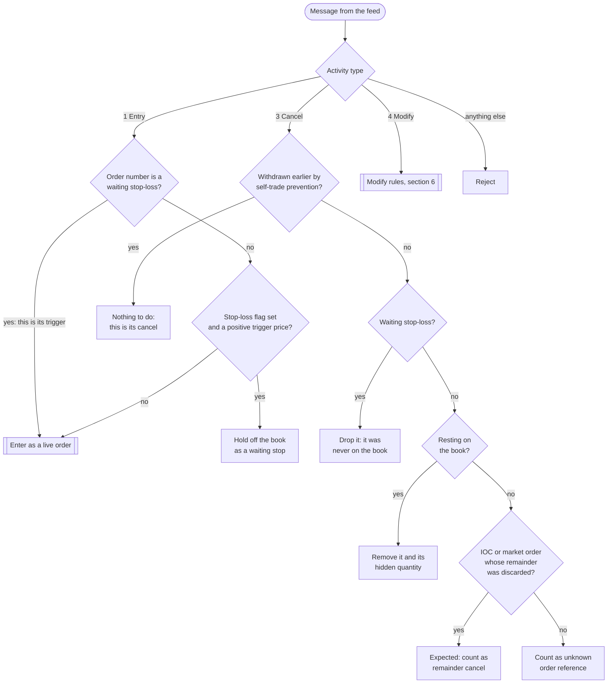
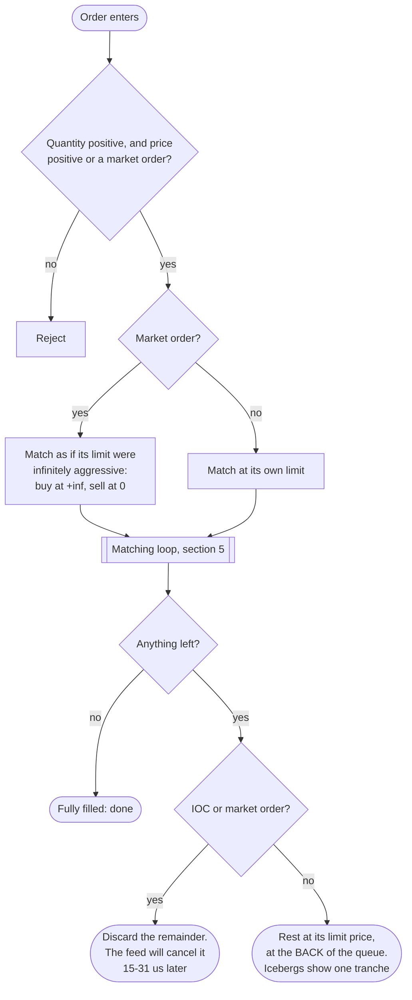
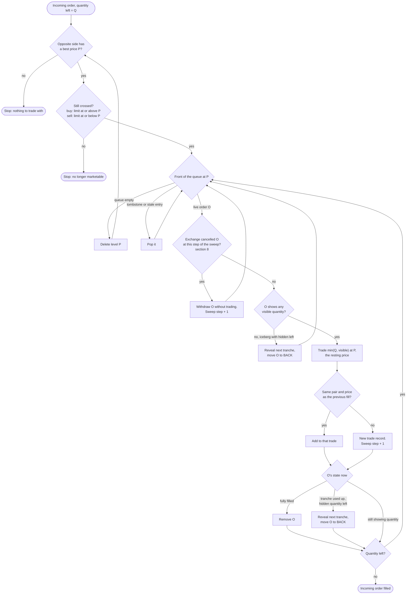
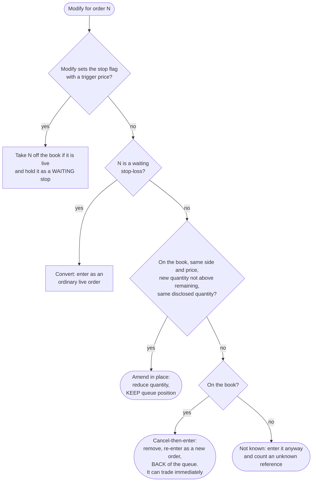
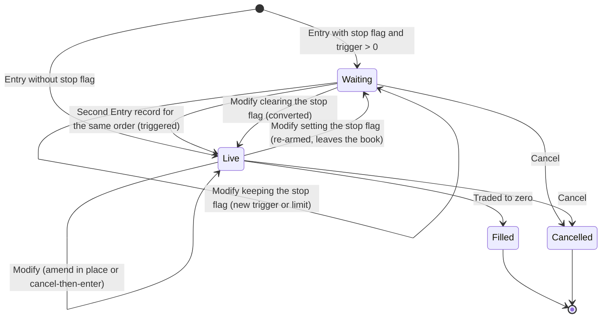
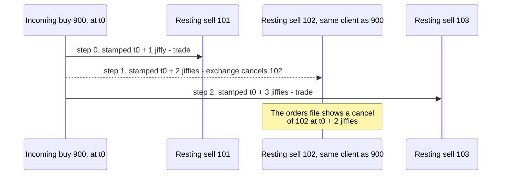
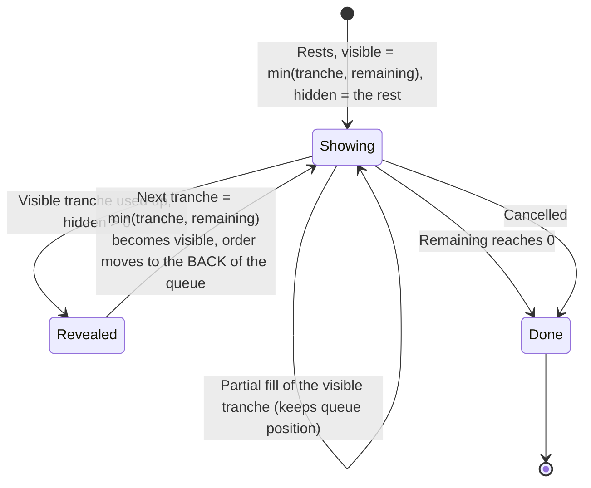

# How the Matching Engine Works

NSE publishes every order message (each entry, modify and cancel) but not the order book
those messages build, and not the matching decisions the exchange made. `nsetick` rebuilds
the book by feeding the messages, in order, through a model of the exchange's matching
engine. This page explains that model from the ground up: what state it keeps, what each
message does to that state, when an order trades at once and when it waits, and the many
NSE-specific quirks that decide whether the rebuilt book is right.

The test of correctness is the exchange's own **trade file**. It lists every execution with
the order number of the buyer and of the seller. The engine produces the same kind of record,
so the two can be compared trade by trade. See [Validation and Accuracy](Validation-and-Accuracy)
for the results. Every rule below was either confirmed that way, or found through a mismatch
that it then fixed.

If you are new to order books, read the first two sections. If you already know price-time
priority, skip to [section 4](#4-entering-an-order-trade-now-rest-or-discard).

---

## 1. Background: what a limit order book is

A **limit order** says: *buy (or sell) up to this quantity, at this price or better.* Orders
that cannot trade straight away wait in the **book**, grouped by price:

```
        SELL side (asks)                 price    qty   orders in time order
        ---------------------------------------------------------------
                                         101.00   300   [#17 200] [#22 100]
        best ask  ->                     100.50   150   [#9 150]
        ---------------------------- spread ----------------------------
        best bid  ->                     100.00   400   [#4 250] [#11 100] [#30 50]
                                          99.50   500   [#2 500]
        BUY side (bids)
```

* The **best bid** is the highest price anyone will pay. The **best ask** is the lowest
  price anyone will sell at. The gap between them is the **spread**.
* An incoming order that reaches across the spread (a buy priced at or above the best ask,
  or a sell at or below the best bid) is **marketable**. It trades at once against the
  resting orders on the other side.
* Among resting orders, **better price goes first**. At the same price, **the order that
  arrived first goes first**. This is *price-time priority*. The waiting line at one price
  is the **queue**.
* A trade always happens at the **resting** order's price. A buy at 101.00 that meets an ask
  at 100.50 trades at 100.50. The incoming order gets the better price.

The order that arrives and trades is the **aggressor** (or *incoming* order). The order it
trades against is the **resting** (or *passive*) order.

## 2. What the engine keeps

For each security, the engine holds:

| State | What it is |
|---|---|
| **Price levels** | Two sorted maps (bids and asks) from price to a level. Each level stores its total visible and hidden quantity, and a first-in-first-out **queue** of order numbers. |
| **Resting orders** | For each order on the book: side, price, **visible** quantity, **hidden** quantity, **tranche** size (for icebergs), **remaining** total, and the participant flags (`algo_indicator`, `client_identity`). |
| **Waiting stop-loss orders** | Stop orders that have not triggered yet. They are held *off* the book. |
| **Discarded remainders** | IOC and market orders whose unfilled part was thrown away, so the cancel the feed writes for it later can be recognised. |
| **Announced cancels** | Cancels read *ahead* of the current message, used for self-trade prevention (section 8). |

Prices are integer **paise** throughout, so comparisons are exact.

A cancelled order is not searched for in its queue. It is deleted from the order map, and its
queue entry is left behind as a **tombstone** that is skipped when it reaches the front.
Each placement also carries a sequence number. When a modify re-enters the same order number,
its old queue entry is recognised as stale and skipped too.

## 3. The three messages

The orders file has one record per message, with an **activity type**:

| Type | Meaning | What the engine does |
|---|---|---|
| `1` | **Entry**: a new order (or a stop-loss order's trigger; see section 7) | Match it; rest or discard what is left |
| `3` | **Cancel** | Remove the order from wherever it is |
| `4` | **Modify** | Change the order: in place, or by removing and re-entering it |

The top-level flow for one message:



---

## 4. Entering an order: trade now, rest, or discard

This is the heart of the engine. When an order enters (a new order, a triggered stop, or a
modify that re-enters), four things happen in sequence.



**Step 1: validate.** A non-positive quantity is rejected. So is a zero or negative price,
*unless* it is a market order (see below).

**Step 2: match.** While the order is still marketable, it trades against the other side, best
price first (section 5). This is the **immediate execution**.

**Step 3: what is left.** If the order is filled completely, it never touches the book. If
some quantity is left, the order type decides what happens to it:

| Order type | Unfilled quantity |
|---|---|
| Ordinary limit order (day order) | **Rests** at its limit price, at the **back** of that price's queue. |
| **IOC** (immediate-or-cancel) | **Discarded.** It never rests, not even for a microsecond. |
| **Market** order | **Discarded**, like IOC. A market order that finds no liquidity simply does nothing. |
| **Iceberg** (disclosed quantity) | Rests. Only one tranche is **visible**; the rest is **hidden** behind it (section 9). |

**Step 4: remember discards.** NSE follows each discarded IOC or market remainder with an
explicit cancel message, 15–31 µs later. The engine notes the order number, so that cancel is
recognised as expected rather than flagged as unknown.

### Market orders

In the orders file, a market order has `mkt_order_flag = Y` and a **limit price of 0**. Treating
that zero as a real price would make a market *buy* unable to buy anything. Earlier versions
rejected these orders as invalid, which dropped 3.4% of all entries: the most aggressive flow
in the session. The engine instead matches a market buy as if its limit were infinite, and a
market sell as if its limit were zero. It walks the book until it is filled or the other side
is empty. Each fill still prints at the resting order's price.

### IOC orders

IOC means *trade what you can now, cancel the rest*. The feed shows this clearly: every IOC
that is unfilled or partly filled is followed by a cancel within about 15–31 µs, and fully
filled IOCs never are. If the engine let the remainder rest until that cancel arrived, orders
arriving in those microseconds could trade against liquidity that was never really there. So
the remainder is discarded at once.

### When does an order go to the back of the queue?

| Situation | Queue position |
|---|---|
| New order rests | Back of the queue at its price |
| Partially filled, still showing quantity | **Keeps** its position at the front |
| Iceberg reveals its next tranche | **Back** of the queue (section 9) |
| Modify: quantity reduced, same price and disclosed quantity | **Keeps** its position |
| Modify: price changed | **Back**, at the new price |
| Modify: quantity increased | **Back** |
| Modify: disclosed quantity changed | **Back** |
| Stop-loss triggers | Back of the queue, timed from the trigger |

---

## 5. The matching loop

The incoming order works through the opposite side one price level at a time, and through each
level one order at a time:



Points worth noticing:

* **Levels are swept in price order.** A large buy takes everything at the best ask, then moves
  to the next ask, and so on. It keeps going until it is filled or the next ask is above its
  limit.
* **Every fill is at the resting price.** A buy limited at 102 that sweeps asks at 100, 101 and
  102 produces trades at 100, 101 and 102.
* **A partly filled resting order keeps its place.** If the incoming order takes 30 of a resting
  order's 100, the other 70 stays at the front.
* **Only visible quantity trades directly.** Hidden iceberg quantity can trade, but only after it
  has been revealed as a tranche, and that tranche joins the back of the queue.

### One trade per pair

The exchange writes **one trade record per (incoming, resting) pair per price** in a sweep.
Say an incoming order eats through an iceberg that is alone at its price. Each revealed
tranche goes to the back of a queue that has nothing else in it, so it is immediately at the
front again. The exchange prints the whole execution as **one** trade. The engine merges
consecutive fills of the same pair at the same price in the same way. If anything else traded
in between, the fills are separate trades.

---

## 6. Modify

A modify record (activity type 4) carries the order's **new state**. It includes the new
price and the **remaining** quantity, not the original total: fills since entry have already
been subtracted. The engine decides between two treatments:



* **Reduce-only amend keeps priority.** Lowering the quantity at the same price is harmless
  to other traders, and NSE keeps the order's place. The trade file confirms this: treating
  these as cancel-then-enter moved orders behind others they had in fact traded ahead of.
* **Everything else is cancel-then-enter.** A price change, a quantity increase, or a change
  to the disclosed quantity removes the order and re-enters it as if it were new. A re-entered
  order **goes through the full entry path**. If its new price crosses the spread, it trades
  immediately, exactly like a new order.
* **A modify of an unknown order** happens legitimately in one case. When a market order's
  remainder has been discarded, the exchange can convert that remainder to a limit order by
  modifying it. The engine enters it, and does not count the conversion as an error.

---

## 7. Stop-loss orders

A stop-loss order is dormant until the market reaches its **trigger price**. It then becomes
an ordinary limit (or market) order. The feed marks such orders `stop_loss_flag = Y` with a
`trigger_price`.

Crucially, the **exchange** decides when a stop triggers, and it **writes a second entry
record** for the same order number at that moment. No ordinary order ever has two entry
records. The engine does **not** try to work out triggers itself from the prices it has
matched. That was tried: small differences in the replayed last price fire stops a few
trades early, and the stop then takes liquidity that was really taken by someone else. It
simply follows the feed.



A waiting stop is **not** on the book. It adds no depth, is invisible in snapshots, and cannot
be traded against. When it triggers, it enters with time priority from the trigger, and can
trade immediately if its limit is marketable.

---

## 8. Self-trade prevention (STP)

Exchanges do not let a client trade with itself. At NSE, when an incoming order would match a
resting order belonging to the **same client**, the exchange **cancels the resting order**
instead, and the incoming order carries on to the next order in the queue.

The difficulty is that the orders file **has no client identifier**. All the replay can see
is the result: a cancel of the resting order, written by the exchange *during* the incoming
order's sweep. Without handling this, the replay would trade the two orders, since the cancel
appears in the file *after* the entry that caused it. That puts phantom trades and wrong queue
positions into the book.

### The feed's clock gives it away

The exchange stamps messages in **jiffies** of 1/65536 s (≈ 15.26 µs). When one incoming
order produces several messages (trades, and cancels of self-trade-prevented orders), each is
stamped **one jiffy after the previous one**:

```
 t0             incoming order entry                     (timestamp in the orders file)
 t0 + 1 jiffy   message for sweep step 0   e.g. trade with resting order A
 t0 + 2 jiffies message for sweep step 1   e.g. STP cancel of resting order B   <- orders file
 t0 + 3 jiffies message for sweep step 2   e.g. trade with resting order C
 ...
 t0 + (k+1) jiffies   message for step k
```

So an STP cancel is not simply "a cancel soon after". It is a cancel stamped **exactly at the
step of the sweep where the incoming order reached that resting order**.



### What the engine does

1. **Read ahead.** The replay reads the feed up to **100 ms** ahead of the message it is
   applying. Every cancel it sees is *announced* to the book (`OrderBook::announce`). 100 ms
   covers sweeps of several thousand steps.
2. **Count the sweep.** While matching an incoming order, the engine counts the steps: each
   new trade record and each STP withdrawal is one step.
3. **Check each resting order before trading it.** A resting order is withdrawn, not traded,
   when:
   * a cancel for it has been announced at time *t* with
     `|(t − t0) − (step + 1) × jiffy| ≤ 2 jiffies + 2 µs` (timestamps are truncated to whole
     microseconds), **and**
   * it could be the same client: it has the same `algo_indicator` and `client_identity`
     category as the incoming order. These are the only parts of a client's identity the file
     records.
4. When the resting order's own cancel is later applied, the engine recognises it as already
   handled.

Why so exact? Traders often cancel their own orders soon after a partial fill, a few hundred
microseconds later. A loose "cancelled within 1 ms" rule withdrew those as well, before they
had in fact traded. It also missed genuine STP cancels deep inside large sweeps, stamped 2–4
ms after the entry. Slot timing tells the two apart.

Callers that never announce events get the plain textbook behaviour: every resting order can
be matched. The replay in `nsetick book` and `replay_fills` always announces.

---

## 9. Icebergs (disclosed quantity)

An order with `0 < volume_disclosed < volume_original` is an **iceberg**. It shows only
`volume_disclosed` (one **tranche**) at a time. The rest is real liquidity that nobody else
can see.



* **Replenishment loses priority.** Every newly revealed tranche joins the **back** of the
  queue at its price, behind orders that arrived after the iceberg did. The trade file
  confirms this: keeping the iceberg at the front dropped exact trade matches from about 95% to
  about 65%.
* **A partly filled iceberg that rests** (it traded some on entry) shows one full tranche, or
  whatever is left if that is less.
* **Snapshots report both parts.** `bid_qty_k` / `ask_qty_k` are what other participants saw.
  `bid_hidden_k` / `ask_hidden_k` are what was really there.
* **A modify that changes `volume_disclosed`** is cancel-then-enter with the new tranche size.

---

## 10. A worked example

The book starts with three sell orders at 100.00 and one at 100.50 (quantities in shares):

| Queue at 100.00 | Order | Visible | Hidden | Notes |
|---|---|---|---|---|
| 1st | #1 | 100 | 400 | iceberg, tranche 100 |
| 2nd | #2 | 50 | 0 | same participant category as the buyer; the file has its cancel at t0+2j |
| 3rd | #3 | 200 | 0 | |
| at 100.50 | #4 | 300 | 0 | |

A **buy limit 100.50 for 500** (#9) arrives at t0:

| Step | Stamp | What happens | Buy left |
|---|---|---|---|
| 0 | t0+1j | Trade #9 × #1: 100 @ 100.00. #1's tranche is used up: reveal 100, #1 moves behind #3 | 400 |
| 1 | t0+2j | Front is now #2. A cancel for #2 is announced at t0+2j, in this step's slot, and the client could match. **Withdrawn**, no trade | 400 |
| 2 | t0+3j | Trade #9 × #3: 200 @ 100.00 | 200 |
| 3 | t0+4j | Trade #9 × #1 (its second tranche): 100 @ 100.00. Reveal again, #1 to the back (it is now alone) | 100 |
| (merged) | | #1 is at the front again. Trade #9 × #1: 100 more @ 100.00, **merged into step 3's trade** (same pair and price, nothing in between) | 0 |

The trade file shows four trades: #9×#1 100, #9×#3 200, #9×#1 200, all at 100.00, and no
trade with #2. The ask at 100.50 is untouched, because the order was filled before it got
there. (j is one jiffy; #2's cancel counts as STP because it sits in the slot of step 1,
the step at which the sweep reached #2.)

Had the buy been an **IOC for 1,200**, it would have taken all 700 at 100.00, #1's
remaining tranches included, then 300 at 100.50 (still within its limit). The last 200 would
have been discarded, not rested at 100.50.

---

## 11. What the engine does not model

* **The pre-open call auction** (09:00–09:08). NSE collects orders and matches them at one
  price. The engine matches them continuously as they arrive, so the book before 09:15 is
  approximate. Use snapshots and trades from **09:15** onward. The comparison with the trade
  file uses the continuous session only.
* **Price bands, circuit breakers, trading halts, freeze-quantity rejections.** Orders the
  exchange rejected never appear in the orders file, so no model of these is needed.
* **Where an iceberg's next tranche trades.** When an incoming order uses up an iceberg's
  visible tranche and still wants more at that price, the engine puts the new tranche at the
  back of the queue. If the iceberg is **alone** at its price, that means it is immediately at
  the front again, and the incoming order carries on into it. If **other orders** are queued,
  the incoming order moves on to them first. Measured at every such moment (TCS, INFY and
  RELIANCE, 25 Jan 2022, about 750,000 cases), the pair ends up trading exactly the
  exchange's quantity in **97.6%** of cases when the iceberg is alone, but only **87–91%**
  when other orders are queued. In those misses the exchange took more from the iceberg about as
  often as it took less. The queued order's age, whether it was just modified, whether it is
  itself an iceberg, and whether it is older than the iceberg were all checked; none separates
  the two outcomes. This is the largest single cause of the remaining difference from the trade
  file, and it changes who traded with whom far more often than how much each order traded.
* **Client identity.** STP is inferred from timing and participant category. On rare
  occasions, a coincidental cancel in exactly the right slot from a different client of the
  same category would be treated as STP.

## 12. Counters

`OrderBook::stats()` (and the snapshot `interval_*` columns) expose what the engine did. They
are useful for checking a replay:

| Counter | Meaning |
|---|---|
| `entries`, `cancels`, `modifies` | Messages of each type applied |
| `events_rejected` | Unusable messages: non-positive quantity, zero price on a non-market order, unknown type |
| `unknown_order_refs` | Cancels or modifies naming an order the book never saw. A few at the start are normal; many means something is wrong |
| `trades_generated`, `volume_matched` | Trade records produced, and shares matched |
| `replenishments` | Iceberg tranches revealed |
| `market_orders` | Market orders entered |
| `unrested_quantity` | IOC and market quantity discarded unfilled |
| `remainder_cancels` | The feed's cancels for those discarded remainders (expected) |
| `amended_in_place` | Modifies that kept queue priority |
| `stops_held` | Stop-loss orders put into the waiting state |
| `stops_triggered` | Stops that entered the book, by trigger record or conversion |
| `self_trade_preventions` | Resting orders withdrawn by STP |

## 13. Check it yourself

```python
import nsetick
fills = nsetick.replay_fills("parsed/segment=cm/kind=orders/date=2022-01-25", symbols=["TCS"])
# pyarrow Table: symbol, txn_time, trade_price, trade_quantity,
#                buy_order_number, sell_order_number, aggressor
```

Join it with the parsed trade file on `(buy_order_number, sell_order_number)`, or run the
ready-made comparison:

```bash
python tools/verify_replay.py parsed/            # every session and security found
python tools/verify_replay.py parsed/ --symbols TCS INFY --dates 2022-01-25
```

See [Validation and Accuracy](Validation-and-Accuracy) for what the numbers mean and the
results across many sessions.
